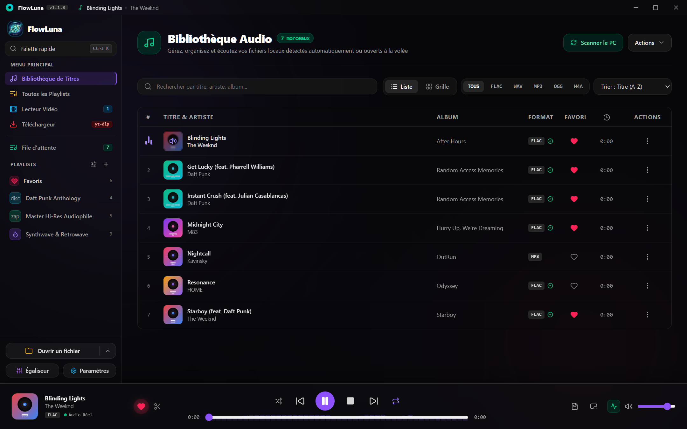
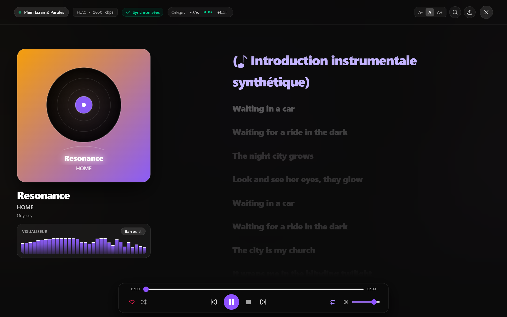
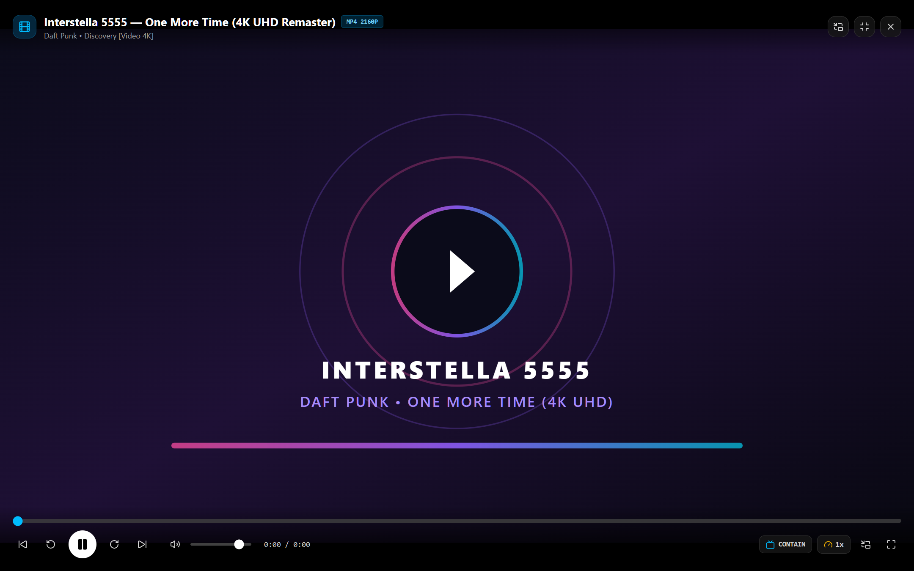
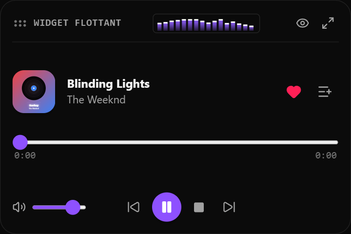

# 🎵 FlowLuna — Lecteur Audio Hi-Fi & Downloader Natif Windows

<div align="center">
  

  <p>
    <a href="https://github.com/vortexazur/FlowLuna/releases"></a>
    <a href="https://github.com/vortexazur/FlowLuna"></a>
    <a href="https://dotnet.microsoft.com/"></a>
    <a href="https://developer.microsoft.com/microsoft-edge/webview2/"></a>
    <a href="https://github.com/videolan/libvlcsharp"></a>
    <a href="LICENSE"></a>
    <a href="https://github.com/vortexazur/FlowLuna/actions"></a>
    <a href="https://github.com/vortexazur/FlowLuna"></a>
  </p>

  <p>
    <strong>Lecteur multimédia audiophile haute fidélité pour Windows avec interface Pure Glass XAML, moteur audio LibVLCSharp, égaliseur 10 bandes, visualiseur réactif, architecture native C# .NET 9 + WebView2 et extraction avancée yt-dlp & FFmpeg.</strong>
  </p>

  <p>
    <em>🤖 Logiciel conçu et développé avec l'Intelligence Artificielle (IA)</em>
  </p>

  <p>
    <a href="https://github.com/vortexazur/FlowLuna/releases">Télécharger la Dernière Version</a> • 
    <a href="#-fonctionnalités-clés">Fonctionnalités Clés</a> • 
    <a href="#-installation">Installation</a> • 
    <a href="#-raccourcis-clavier">Raccourcis Clavier</a> • 
    <a href="#-architecture-technique">Architecture</a>
  </p>
</div>

---

## ✨ Présentation

> [!NOTE]
> **Projet conçu & développé par Intelligence Artificielle (IA) :**  
> FlowLuna est une application développée de bout en bout avec l'assistance de l'Intelligence Artificielle (IA). L'architecture logicielle, le code source (C# .NET 9, React 19, TypeScript), les intégrations multimédias et le design de l'interface utilisateur ont été entièrement programmés et itérés en pair-programming assisté par IA.

**FlowLuna** est une application de bureau conçue pour offrir une expérience d'écoute sans compromis sous Windows. Propulsée par **C# .NET 9**, **Microsoft Edge WebView2**, **LibVLCSharp (VideoLAN)**, **React 19**, **Vite** et un serveur in-process ultra-rapide **ASP.NET Core Kestrel**, elle réunit le meilleur du traitement audio numérique, de la lecture locale ultra-fluide et de l'extraction multimédia haute performance avec une empreinte mémoire et disque réduite à seulement ~70 Mo.

---

## 🚀 Fonctionnalités Clés

### 🎬 Moteur Multimédia LibVLCSharp (VideoLAN) & Interface Pure Glass
FlowLuna réunit la puissance du moteur multimédia **LibVLCSharp** ([VideoLAN](https://github.com/videolan/libvlcsharp)) et une interface fluide **Pure Glass & Acrylic** accélérée par DWM :
- **Décodage universel matériel :** Prise en charge native de tous les codecs audio et conteneurs vidéo (*FLAC, ALAC, MP3, WAV, AAC, Opus, Ogg Vorbis, MKV, MP4, WebM*).
- **Égaliseur graphique LibVLC 10 bandes :** Calibré selon les fréquences ISO standard VLC (31 Hz à 16 kHz) avec pré-amplification et presets audiophiles officiels.
- **Translucidité Pure Glass personnalisable :** Effet de profondeur dépoli moderne avec gestion dynamique de l'opacité et accentuation des couleurs.

<p align="center">
  
</p>

### 🎤 Mode Plein Écran & Paroles Synchronisées (Karaoké)
- **Synchronisation dynamique en direct :** Défilement automatique fluide avec surlignage lumineux de la phrase en cours d'écoute.
- **Visualiseur audio 100% réactif :** Analyse spectrale en temps réel au bas de l'écran avec sélecteur de styles visuels (*Barres*, *Onde*, *Piliers*, *Radar*, *LEDs Micro*).
- **Gestion des intros instrumentales & calage manuel :** Détection automatique des pauses instrumentales et micro-ajustement fin (`-0.5s` / `+0.5s`) sauvegardé par morceau.

<p align="center">
  
</p>

### 📺 Lecteur Vidéo Haute Définition & Mode Cinéma (4K / 1080p)
- **Lecture vidéo fluide accélérée :** Prise en charge native des fichiers MP4, WebM, MKV et MOV avec décodage matériel GPU sans saccades.
- **Mode Cinéma immersif :** Affichage grand écran avec commandes escamotables automatiques, sélecteur de ratio (*Contain / Cover / 16:9*), vitesse réglable (0.5x à 2x) et badge de résolution dynamique.
- **Mode Picture-in-Picture (PiP) :** Basculez en un clic vers la fenêtre flottante au-dessus de vos autres applications.

<p align="center">
  
</p>

### ⚡ Downloader Universel Haute Performance (yt-dlp & FFmpeg)
- **Binaires natifs Windows 64-bit :** `yt-dlp.exe` et `ffmpeg.exe` intégrés hors ASAR pour un accès direct et des vitesses d'exécution optimales.
- **Suivi temps réel & Historique :** Progression en direct avec jauge, vitesse en Mo/s, panneau d'historique dédié et intégration directe dans la bibliothèque.
- **Formats audio sans perte & vidéo HD :** Téléchargement en *FLAC, MP3 (320 kbps HD), WAV, AAC, Opus* ou vidéos jusqu'en *4K UHD / 1080p*.
- **Compatibilité multi-plateformes :** Extraction depuis YouTube, SoundCloud, TikTok, Instagram, X/Twitter, etc.

<p align="center">
  
</p>

### 🖼️ Mode Widget Flottant Exclusif Always-on-Top
- **Transformation exclusive :** D'un simple clic sur le widget flottant, l'application complète s'efface pour ne laisser **QUE** le widget flottant ultra-compact sur votre bureau.
- **Mode Always-on-Top natif :** Fenêtre Windows compacte (360x240) épinglée au premier plan au-dessus de vos jeux et applications, avec barre de déplacement, spectre temps réel et menu de sélection de playlists dynamique.

<p align="center">
  
</p>

### 🎛️ Traitements DSP & Normalisation Sonore EBU R128
- Égaliseur paramétrique 10 bandes avec contrôle indépendant du gain (±12 dB).
- Presets audiophiles prédéfinis : *Flat, Bass Boost, Treble Boost, Électronique, Rock, Acoustique, Vocal, etc.*
- Traitements sonores intégrés : Amplification des basses (*Bass Boost*), clarté des aigus (*Treble Boost*), pré-amplification (*Preamp Gain*) et **normalisation sonore intelligente EBU R128 / ReplayGain** (-14 LUFS Streaming, -18 LUFS ReplayGain, -23 LUFS Broadcast / Cinéma) sur une ligne pleine largeur dédiée avec limiteur True Peak à -1.0 dBTP.

### 📊 Visualiseur Audio Temps Réel
- Analyseur de fréquences FFT interactif connecté directement au moteur Web Audio.
- Plusieurs modes de visualisation : Barres spectrales dynamiques, onde oscilloscopique et particules translucides.
- Animation fluide à 60 FPS avec arrêt intelligent en pause pour préserver le processeur et la mémoire vive (RAM).

### 🪟 Intégration Native Windows XAML, SMTC & Discord RPC
- **Hôte XAML WPF / Windows App SDK :** Fenêtre native optimisée pour le Microsoft Store avec effet de fond DWM Mica / Acrylic et consommation de RAM allégée via Workstation GC.
- **Windows SMTC (System Media Transport Controls) :** Vignette multimédia officielle Windows 11/10 avec pochette d'album haute résolution, titre, artiste et commandes lors du réglage de volume ou sur l'écran de verrouillage.
- **Discord Rich Presence (RPC) :** Affiche automatiquement votre musique en temps réel sur votre profil Discord via Named Pipes locaux.
- **Raccourcis Clavier Multimédias Globaux :** Pilotez la lecture avec les touches matérielles de votre clavier ou casque (`Play/Pause`, `Suivant`, `Précédent`, `Stop`) via le hook Win32 `WM_APPCOMMAND`.
- **Barre de titre Frameless Glass :** Design translucide avec zones de glissement fluide et commandes de fenêtre intégrées (*Réduire, Agrandir/Restaurer, Fermer*).

### 💾 Bibliothèque Locale & Outils de Production
- Analyse et importation ultra-rapides de dossiers musicaux locaux.
- Outil de découpe de morceaux (*Audio Trimmer*) et de fusion de pistes (*Audio Merger*).
- Éditeur de métadonnées et tags de pistes (*Track Tag Editor*).
- Détecteur de doublons et recherche instantanée avec palette de commandes (`Ctrl + K`).

---

## 💻 Matrice des Prérequis

| Composant | Prérequis Minimal | Recommandé |
|---|---|---|
| **Système d'exploitation** | Windows 10 (64-bit, Version 1903+) | Windows 11 (64-bit, Version 22H2+) |
| **Processeur (CPU)** | Intel Core i3 / AMD Ryzen 3 ou équivalent | Intel Core i5 / AMD Ryzen 5 ou supérieur |
| **Mémoire Vive (RAM)** | 4 Go | 8 Go ou plus |
| **Espace Disque** | 400 Mo disponibles | 1 Go+ (selon le cache hors-ligne) |
| **Accélération Graphique** | Compatible DirectX 11 / OpenGL | GPU dédié ou iGPU récent |

---

## 📦 Installation

1. Rendez-vous dans la section [Releases](https://github.com/vortexazur/FlowLuna/releases).
2. Téléchargez l'installateur officiel **`FlowLuna-Setup-1.2.2.exe`** (~115 Mo).
3. Lancez l'exécutable : l'application installe automatiquement le binaire natif C# .NET 9 + WebView2, configure les dépendances audio LibVLCSharp et crée les raccourcis sur le Bureau et le Menu Démarrer.

---

## ⌨️ Raccourcis Clavier

| Raccourci | Action |
|---|---|
| <kbd>Espace</kbd> ou Touche Multimédia Play/Pause | Lecture / Pause |
| <kbd>N</kbd> ou Touche Multimédia Suivant | Titre suivant |
| <kbd>P</kbd> ou Touche Multimédia Précédent | Titre précédent |
| <kbd>←</kbd> / <kbd>→</kbd> | Reculer / Avancer de 5 secondes |
| <kbd>↑</kbd> / <kbd>↓</kbd> | Augmenter / Diminuer le volume |
| <kbd>M</kbd> | Activer / Désactiver le mode Muet |
| <kbd>L</kbd> | Ajouter ou retirer le titre des Favoris |
| <kbd>S</kbd> | Basculer la lecture aléatoire (*Shuffle*) |
| <kbd>R</kbd> | Basculer le mode répétition (*Off / Tout / Piste*) |
| <kbd>E</kbd> | Ouvrir l'Égaliseur 10 bandes |
| <kbd>F</kbd> | Mode Plein Écran & Affichage des Paroles |
| <kbd>W</kbd> | Mode Mini-Lecteur d'appoint compact |
| <kbd>Ctrl</kbd> + <kbd>K</kbd> | Ouvrir la Palette de commandes rapide |

---

## 🛠️ Développement & Compilation Locale

### 1. Cloner le dépôt et installer les dépendances
```bash
git clone https://github.com/vortexazur/FlowLuna.git
cd FlowLuna
npm install
```

### 2. Lancer la version Native C# .NET 9 + WebView2
```bash
# Compile le frontend React et lance le conteneur natif .NET 9
npm run dotnet:run
```

### 3. Compiler l'exécutable unique C# .NET 9 pour production
```bash
# Génère un binaire autonome auto-extractible optimisé dans release-dotnet/FlowLuna.exe
npm run dotnet:publish
```

---

## 🏗️ Architecture Technique

```
flowluna/
├── FlowLuna.Windows/             # Hôte natif C# .NET 9 & WebView2 (Prêt Microsoft Store)
│   ├── Program.cs                # Point d'entrée STA, boucle d'événements & initialisation
│   ├── MainWindow.cs             # Fenêtre WPF frameless, DWM Acrylic backdrop Win32 & Tray
│   └── Services/
│       ├── HttpServer.cs         # Serveur Kestrel in-process local (endpoints REST & audio)
│       ├── DownloaderEngine.cs   # Moteur yt-dlp C# avec parsing regex & flux SSE
│       └── LibraryScanner.cs     # Indexation multithreadée ultra-rapide des disques
├── bin/                          # Binaires Windows externes exclus
│   ├── yt-dlp.exe                # Moteur d'extraction et métadonnées
│   ├── ffmpeg.exe                # Moteur de transcodage et normalisation audio
│   └── ffprobe.exe               # Analyseur de flux multimédia
├── src/                          # Application Frontend React 19 + Tailwind CSS
│   ├── components/               # Composants d'interface (Pure Glass, Visualiseur, Library...)
│   ├── services/                 # Moteurs audio Web Audio API, filtres biquad
│   ├── i18n.ts                   # Internationalisation 9 langues (FR, EN, ES, DE, IT, PT, JA, ZH, RU)
│   └── types.ts                  # Modèles de données & constantes
├── release-dotnet/               # Sortie du binaire unique autonome C# (FlowLuna.exe)
└── vite.config.ts                # Configuration Vite avec base relative './'
```

---

## 📄 Licence

Ce projet est sous licence **GNU General Public License v3.0 (GPLv3)**. Consultez le fichier [LICENSE](LICENSE) pour plus de détails.
